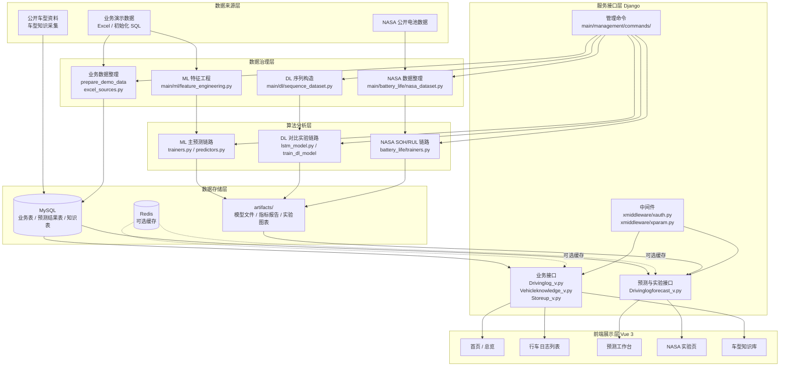
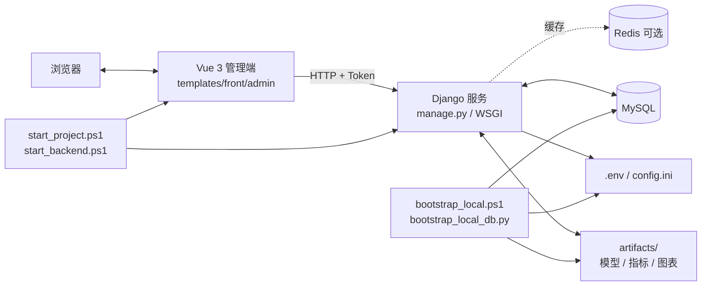

# 系统架构讲解

## 一、架构总览

本项目是一套围绕电动汽车行车日志数据构建的综合分析系统，采用 `Django + Vue 3` 技术栈实现，并将业务管理、在线预测、离线训练和 NASA 电池寿命实验整合到同一仓库中。整体架构可以按六层理解：

- 数据来源层
- 数据治理层
- 数据存储层
- 算法分析层
- 服务接口层
- 前端展示层

六层结构的核心目标是将“数据采集、数据准备、模型训练、结果保存、接口输出、页面展示”串成一条完整链路，使系统既能完成业务操作，也能完成预测与实验展示。

## 二、总体架构图



## 三、运行部署图

下面的图描述的是本地运行时各组件之间的实际关系：



这张图对应当前仓库的实际启动方式：`bin/bootstrap_local.ps1` 负责初始化，`bin/start_project.ps1` 负责启动前后端，Django 同时依赖 MySQL、可选 Redis 和 `artifacts/` 目录中的训练产物。

## 四、各层模块职责

| 层级 | 关键目录 / 文件 | 主要职责 | 关键产出 |
| --- | --- | --- | --- |
| 数据来源层 | `db/`、Excel 样例、`util/vehicle_knowledge_crawler.py`、NASA 数据集目录 | 提供业务演示数据、车型公开资料和 NASA 电池实验数据 | 原始业务数据、公开车型资料、实验原始数据 |
| 数据治理层 | `main/excel_sources.py`、`main/ml/feature_engineering.py`、`main/dl/sequence_dataset.py`、`main/battery_life/nasa_dataset.py` | 数据清洗、字段统一、序列构造、实验样本整理 | 可训练的结构化样本和时序样本 |
| 数据存储层 | MySQL、`artifacts/`、Redis | 保存业务表、预测结果表、知识表、模型文件、指标文件和图表 | 业务数据、预测结果、模型产物、实验图像 |
| 算法分析层 | `main/ml/`、`main/dl/`、`main/battery_life/` | 完成业务预测、深度学习对比实验和 NASA 电池寿命实验 | 预测值、模型指标、对比结果、SOH/RUL 结果 |
| 服务接口层 | `main/*_v.py`、`xmiddleware/`、`main/management/commands/` | 组织业务接口、鉴权处理、训练命令和实验接口 | JSON 接口、训练命令入口、实验图像接口 |
| 前端展示层 | `templates/front/admin/src/` | 将业务管理、预测工作台、实验页和知识页组织为统一界面 | 管理端页面、图表展示、交互入口 |

## 五、三条核心业务链路

### 1. 行车日志业务链路

行车日志业务链路负责系统最基础的数据管理功能，主要过程如下：

1. 演示数据通过初始化 SQL、Excel 或后台录入进入 `drivinglog` 等业务表。
2. Django 业务接口文件如 `main/Drivinglog_v.py` 对外提供分页、详情、增删改查等能力。
3. 前端列表页、详情页、收藏评论页通过统一请求工具访问这些接口。
4. 用户侧完成日志查询、收藏、评论、管理员回复等操作。

这一链路决定了系统是否具备稳定的基础业务承载能力。

### 2. 车型知识采集链路

车型知识采集链路负责补充公开车型资料，主要过程如下：

1. 车型信息从业务表或页面操作中触发采集请求。
2. `util/vehicle_knowledge_crawler.py` 获取公开车型资料。
3. 采集结果写入 `vehicleknowledge` 表。
4. `main/Vehicleknowledge_v.py` 将结果提供给前端知识库页面和列表页面入口。

这一链路的作用是补全车型维度的公开知识信息，而不是伪造原始行车遥测数据。

### 3. 在线预测链路

在线预测链路是系统中最核心的智能分析链路，主要过程如下：

1. 前端预测工作台收集车辆参数、里程、驾驶行为评分、路线类型等输入。
2. `templates/front/admin/src/utils/http.js` 统一发送请求，并在请求头中附带 `Token`。
3. `xmiddleware/xauth.py` 和 `xmiddleware/xparam.py` 完成鉴权和参数处理。
4. 请求进入 `main/Drivinglogforecast_v.py`。
5. `Drivinglogforecast_v.py` 调用 `main/ml/predictors.py` 中的 `predict_drivinglog`、`load_ml_bundle` 等函数。
6. `main/ml/predictors.py` 检查 `artifacts/` 中是否已有模型和指标；若缺失则触发训练产物生成。
7. 已存在的模型文件和指标报告从 `artifacts/models`、`artifacts/reports` 中加载。
8. 预测结果生成后，可写入 `drivinglogforecast` 表，并返回给前端页面。
9. 前端将耗电量、电池寿命、风险等级、主要影响因素和模型指标组织为卡片与图表。

这一链路的关键特征是“训练产物与运行时接口解耦”：训练在离线命令阶段完成，运行时接口直接加载产物并输出结果。

## 六、三条训练与实验链路

### 1. 机器学习主模型训练链路

机器学习主模型训练链路用于生成系统默认预测所依赖的模型文件和指标报告。核心命令为：

```powershell
python manage.py train_ml_models
python manage.py evaluate_ml_models
```

其主要过程如下：

1. `train_ml_models.py` 调用 `main/ml/trainers.py` 中的训练逻辑。
2. 训练数据可来自业务表，也可来自原始遥测 Excel。
3. 训练完成后，由 `save_ml_artifacts` 将模型、指标和清单写入 `artifacts/`。
4. 运行时接口再通过 `main/ml/predictors.py` 加载这些产物。

这条链路是前端预测工作台默认依赖的主链路。

### 2. 深度学习对比实验链路

深度学习链路主要用于方法对比，核心命令包括：

```powershell
python manage.py prepare_sequence_data
python manage.py train_dl_model
python manage.py compare_models
```

其主要过程如下：

1. `prepare_sequence_data.py` 负责生成序列化输入数据。
2. `main/dl/sequence_dataset.py` 和 `main/dl/lstm_model.py` 负责时序样本组织和模型训练。
3. `compare_models.py` 输出与机器学习主链路的对比结果。
4. 对比结果用于说明更复杂模型方案在当前数据条件下的表现。

深度学习链路不直接替代业务主预测输出，而是作为对比实验存在。

### 3. NASA 电池寿命实验链路

NASA 链路负责真实电池公开数据上的 SOH 和 RUL 实验，核心命令包括：

```powershell
python manage.py prepare_nasa_battery_dataset --source-dir datasets\nasa_battery --download
python manage.py train_nasa_battery_models
```

其主要过程如下：

1. `prepare_nasa_battery_dataset.py` 完成 NASA 数据集准备。
2. `main/battery_life/nasa_dataset.py` 负责构造 SOH / RUL 所需实验数据框。
3. `train_nasa_battery_models.py` 调用 `main/battery_life/trainers.py` 执行训练。
4. `train_real_life_models` 生成 SOH 与 RUL 指标，并输出容量衰减曲线、预测散点图等图像。
5. 所有产物统一写入 `artifacts/battery_life/`。
6. `Drivinglogforecast_v.py` 中的 `drivinglogforecast_nasaExperiment` 和 `drivinglogforecast_nasaFigure` 将实验结果和图像提供给前端 NASA 页面。

这条链路与业务预测链路使用不同数据源和目标定义，属于独立实验链路。

## 七、关键表、接口与产物的对应关系

### 1. 关键表

- `drivinglog`：业务主数据表，也是部分训练逻辑的数据来源。
- `drivinglogforecast`：预测结果落库表。
- `vehicleknowledge`：车型知识采集结果表。
- `storeup`、`discussdrivinglog`：收藏评论相关表。

### 2. 关键接口

- `main/Drivinglog_v.py`：行车日志业务接口。
- `main/Vehicleknowledge_v.py`：车型知识接口。
- `main/Drivinglogforecast_v.py`：预测、指标、场景分析、NASA 实验接口。

### 3. 关键产物

- `artifacts/models/`：机器学习与对比模型文件。
- `artifacts/reports/`：ML 指标、对比指标和 manifest。
- `artifacts/battery_life/`：NASA 实验指标、图像和训练清单。

## 八、当前架构的核心取舍

### 1. 业务预测优先使用机器学习主链路

原因是业务数据主要是结构化表格数据，机器学习链路更稳定、特征更清晰，且更容易直接接入页面进行解释和展示。

### 2. 深度学习和 NASA 实验分开组织

深度学习链路负责方法对比，NASA 链路负责电池寿命实验验证。两者与主系统业务预测分开组织，避免数据口径混用。

### 3. 训练与服务分离

训练通过 `manage.py` 命令在离线阶段执行，服务接口在运行阶段直接加载 `artifacts/` 中的现有产物。这样可以降低在线请求复杂度，并提高本地演示的稳定性。

## 九、架构总结

本项目的架构不是单纯的前后端分离，而是由“业务系统 + 预测服务 + 实验链路 + 本地部署脚本”共同组成的综合结构：

- 前端负责统一展示和交互。
- Django 负责业务接口、预测接口和命令调度。
- MySQL 负责业务数据和结果落库。
- `artifacts/` 负责模型、指标和图像产物保存。
- 机器学习链路负责主系统预测。
- 深度学习链路负责方法对比。
- NASA 链路负责电池寿命实验验证。

这套结构共同支撑了项目的业务运行、预测分析、实验展示和本地部署。
